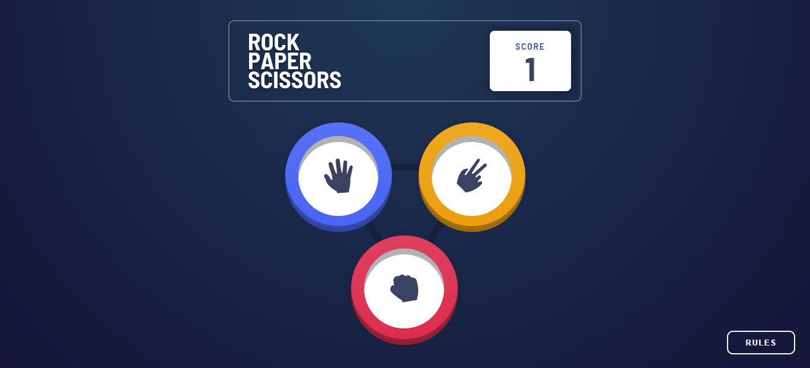

# hand-game-website
# Frontend Mentor - Rock, Paper, Scissors solution

This is a solution to the [Rock, Paper, Scissors challenge on Frontend Mentor](https://www.frontendmentor.io/challenges/rock-paper-scissors-game-pTgwgvgH). Frontend Mentor challenges help you improve your coding skills by building realistic projects. 

## Table of contents

- [Overview](#overview)
  - [The challenge](#the-challenge)
  - [Screenshots](#screenshots)
  - [Links](#links)
- [My process](#my-process)
  - [Built with](#built-with)
  - [Useful resources](#useful-resources)
- [Author](#author)
- [Acknowledgments](#acknowledgments

## Overview

### The challenge

Users should be able to:

- View the optimal layout for the game depending on their device's screen size
- Play Rock, Paper, Scissors against the computer
- Maintain the state of the score after refreshing the browser _(optional)_
- **Bonus**: Play Rock, Paper, Scissors, Lizard, Spock against the computer _(optional)_

### Screenshots

### Links

- Solution URL: [Add solution URL here](https://your-solution-url.com)
- Live Site URL: [Add live site URL here](https://your-live-site-url.com)

## My process

### Built with

- HTML5
- CSS3
- JavaScript

### Continued development

Use this section to outline areas that you want to continue focusing on in future projects. These could be concepts you're still not completely comfortable with or techniques you found useful that you want to refine and perfect.

**Note: Delete this note and the content within this section and replace with your own plans for continued development.**

### Useful resources

- [resource 1](https://www.frontendmentor.io/challenges/rock-paper-scissors-game-pTgwgvgH) - Challenge link.

## Author

- Frontend Mentor - [@devEngAmeer](https://www.frontendmentor.io/profile/devEngAmeer)
- Facebook - [@ameerasady.99](https://www.facebook.com/ameerasady.99)

## Acknowledgments

Many thanks to Frontend Mentor website for providing these challenges with designs for free.